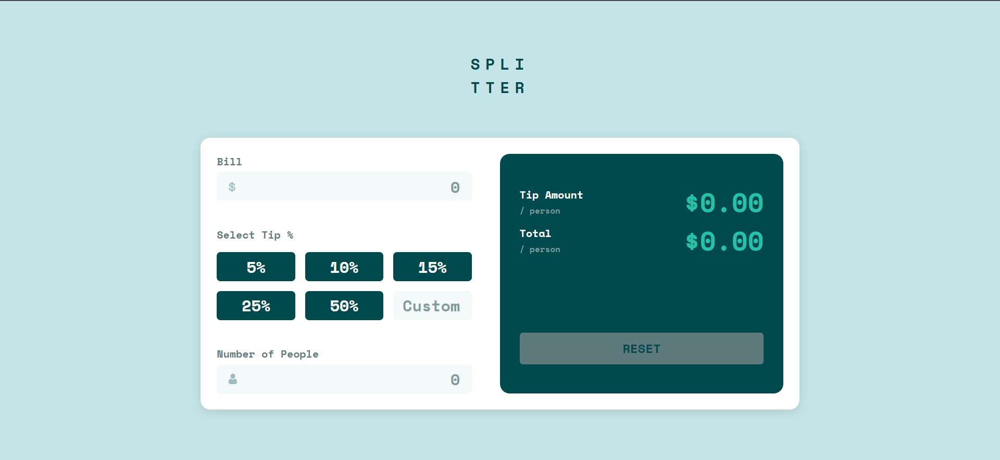

# Frontend Mentor - Tip calculator app solution

This is a solution to the [Tip calculator app challenge on Frontend Mentor](https://www.frontendmentor.io/challenges/tip-calculator-app-ugJNGbJUX). Frontend Mentor challenges help you improve your coding skills by building realistic projects.

## Table of contents

- [Overview](#overview)
  - [The challenge](#the-challenge)
  - [Screenshot](#screenshot)
  - [Links](#links)
- [My process](#my-process)
  - [Built with](#built-with)
  - [What I learned](#what-i-learned)
  - [Continued development](#continued-development)
- [Author](#author)

## Overview

### The challenge

Users should be able to:

- View the optimal layout for the app depending on their device's screen size
- See hover states for all interactive elements on the page
- Calculate the correct tip and total cost of the bill per person

### Screenshot



### Links

- Solution URL: [Solution](https://github.com/edulustosa/tip-calculator-app/blob/main/assets/js/main.js)
- Live Site URL: [Site](https://edulustosa.github.io/tip-calculator-app/)

## My process

### Built with

- Semantic HTML5 markup
- CSS custom properties
- Flexbox
- CSS Grid
- JavaScript

### What I learned

My first project using regular expressions. I'm really proud of this code. It only accepts numbers as input, and the user can type only one decimal point.

```js
billInput.addEventListener("input", function () {

  this.value = this.value.replace(/[^0-9.]/g, "");

  if ((this.value.match(/\./g) || []).length > 1) {
    this.value = this.value.substring(0, this.value.lastIndexOf("."));
  }
});
```

## Author

- Frontend Mentor - [@edulustosa](https://www.frontendmentor.io/profile/edulustosa)
